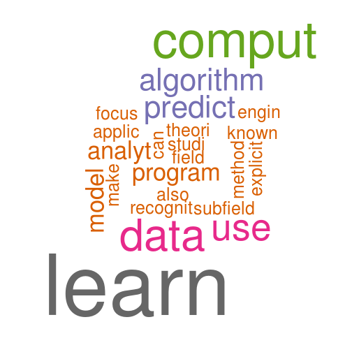

A Wikipedia word cloud visualizer
========================================================
author: David D. Lee
date: 2017.02.22
autosize: true

Usage
========================================================
### - Just Paste any wiki page and click the GO! button.
### - Drag the slider to change min and max frequency of words

Example
========================================================
Machine Learning Page

Code Structure
========================================================
### - global.R: *implements getTermMatrix() funciton, build corpus and get frequency matrix*
### - ui.R: *get url input and output the plot*
### - server.R: *get and parse html, pass it to getTermMatrix() function and plot the word cloud*

Behind the Code
========================================================
## Required packages:
### - tm: *text mining framework*
### - SnowBallC: *build text corpus and frequency matrix (implements Porter's word stemming algorithm)*
### - wordcloud: *plot word cloud*
### - rvest: *get and parse html*
### - memoise: *cache the results of a function*

